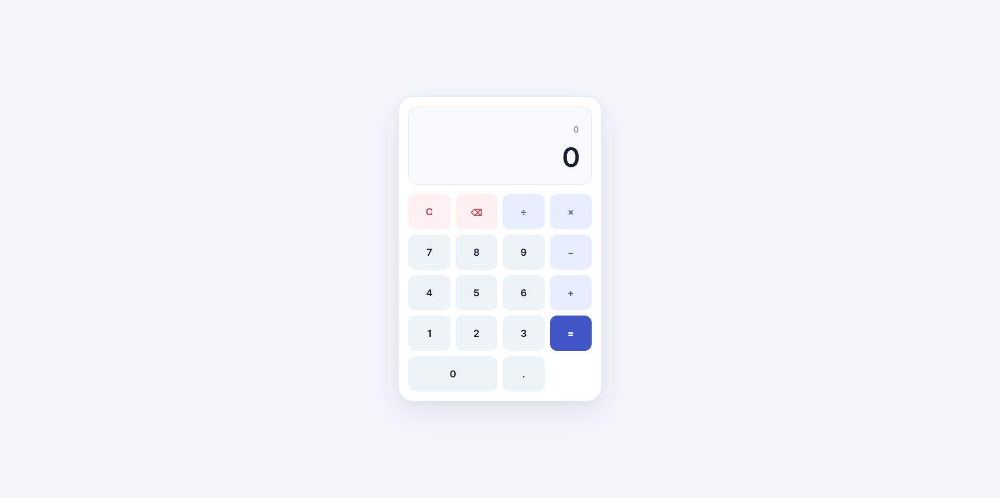
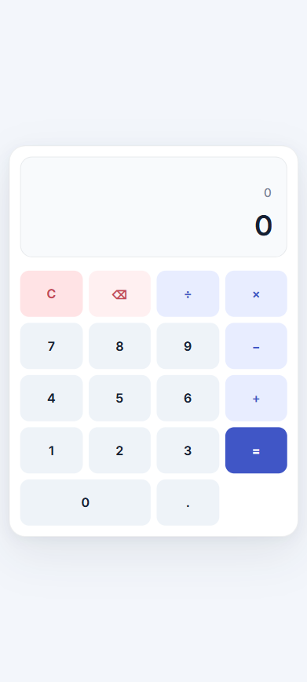

# Modern Calculator

A modern, responsive calculator web application built with HTML, CSS, and vanilla JavaScript as part of the **Oasis Infobyte AICTE OIB-SIP Web Development Internship**.

The project focuses on providing a clean and professional calculator experience with responsive design, keyboard support, proper number formatting, floating-point precision handling, and robust edge-case handling.

## ✨ Features

- Basic arithmetic operations
  - Addition
  - Subtraction
  - Multiplication
  - Division
- Decimal number calculations
- Operator chaining
- Repeated operator replacement
- Clear calculator functionality
- Backspace functionality
- Backspace support after calculating a result
- Keyboard support
- Comma-separated number formatting
- Floating-point precision handling
- Maximum digit protection
- Large-number handling
- Scientific notation handling
- Division-by-zero error handling
- Responsive design for desktop and mobile devices
- Modern and polished user interface
- No external libraries or dependencies required

## 🧮 Calculator Operations

| Operation | Button | Keyboard |
|---|---|---|
| Addition | `+` | `+` |
| Subtraction | `−` | `-` |
| Multiplication | `×` | `*` |
| Division | `÷` | `/` |
| Decimal | `.` | `.` |
| Calculate | `=` | `Enter` / `=` |
| Backspace | `⌫` | `Backspace` |
| Clear | `C` | `Escape` |

## 🛡️ Edge-Case Handling

### Floating-Point Precision

JavaScript floating-point calculations can produce results such as:

```text
0.1 + 0.2 = 0.30000000000000004
```

The calculator rounds calculation results to a reasonable precision so the display shows:

```text
0.3
```

### Repeated Operator Changes

If a user enters:

```text
5 +
```

and then changes the operator to:

```text
5 ×
```

the calculator replaces the pending operator instead of incorrectly calculating against the current input.

### Maximum Digit Limit

A maximum digit limit prevents users from entering excessively long numbers that could break the calculator layout or display.

### Number Formatting

Large ordinary numbers are formatted with comma separators:

```text
1000000
```

becomes:

```text
1,000,000
```

### Large Number Display

Extremely large or extremely small values are handled using scientific notation when appropriate so they remain readable within the calculator display.

### Division by Zero

Division by zero is detected and handled gracefully instead of allowing invalid values such as `Infinity` or `NaN` to appear.

### Backspace After Calculation

After pressing `=`, users can still use Backspace to modify the displayed result instead of being forced to clear the entire calculator.

## 📸 Screenshots

### Desktop



### Mobile



## 🛠️ Technologies

- **HTML5** — Structure and semantic markup
- **CSS3** — Styling, responsive design, layout, and visual effects
- **JavaScript** — Calculator logic, interactions, keyboard controls, and error handling
- **CSS Grid** — Calculator button layout

## 📁 Project Structure

```text
WebDev-L2-Calculator/
├── assets/
│   └── screenshots/
│       ├── desktop.png
│       └── mobile.png
├── index.html
├── style.css
├── script.js
├── .gitignore
└── README.md
```

## 🚀 Getting Started

### Prerequisites

No special software or dependencies are required.

You only need a modern web browser such as:

- Google Chrome
- Microsoft Edge
- Mozilla Firefox
- Safari

### Run Locally

Clone the repository:

```bash
git clone git@github.com:ezedinmoh/OIBSIP.git
```

Navigate to the calculator project:

```bash
cd OIBSIP/WebDev-L2-Calculator
```

Then open:

```text
index.html
```

in your preferred browser.

Alternatively, you can use a local development server such as VS Code Live Server.

## 💻 Usage

The calculator can be operated using either the on-screen buttons or a physical keyboard.

### Keyboard Shortcuts

| Key | Action |
|---|---|
| `0–9` | Enter numbers |
| `.` | Enter decimal point |
| `+` | Addition |
| `-` | Subtraction |
| `*` | Multiplication |
| `/` | Division |
| `Enter` | Calculate |
| `=` | Calculate |
| `Backspace` | Delete last digit |
| `Escape` | Clear calculator |

## 🌐 Live Demo

[Open the live calculator](https://webdev-l2-calculator.vercel.app)

## 🚀 Deployment

The application is deployed using **Vercel**.

The project is a static HTML, CSS, and JavaScript application, so no build process, backend server, database, or environment variables are required.

### Deployment Platform

- Vercel
- Production deployment
- Responsive production-tested application

## 🧪 Testing

The deployed application was tested after production deployment.

The following functionality was verified:

- Basic arithmetic operations
- Decimal calculations
- Floating-point precision
- Number formatting
- Operator replacement
- Backspace functionality
- Backspace after calculation
- Keyboard controls
- Division by zero handling
- Large-number handling
- Responsive desktop layout
- Responsive mobile layout
- Production loading
- Browser console
- Broken resources and links

The production version was verified to work without console errors.

## 🎓 Internship

This project was developed as **Task 1** for the:

**Oasis Infobyte — AICTE OIB-SIP Web Development Internship Program**

Repository:

**OIBSIP**

## 🔮 Future Improvements

Potential future improvements include:

- Calculation history
- Memory functions
- Percentage calculations
- Advanced mathematical operations
- Scientific calculator mode
- Theme switching
- Additional accessibility enhancements

These are optional future improvements and are not required for the current internship task.

## 👨‍💻 Author

**Ezedin Mohammed**

Software Engineering Student & Full-Stack Developer

- LinkedIn: https://www.linkedin.com/in/ezedinmoh
- GitHub: https://github.com/ezedinmoh

## 📄 License

This project was created for educational and internship purposes.
