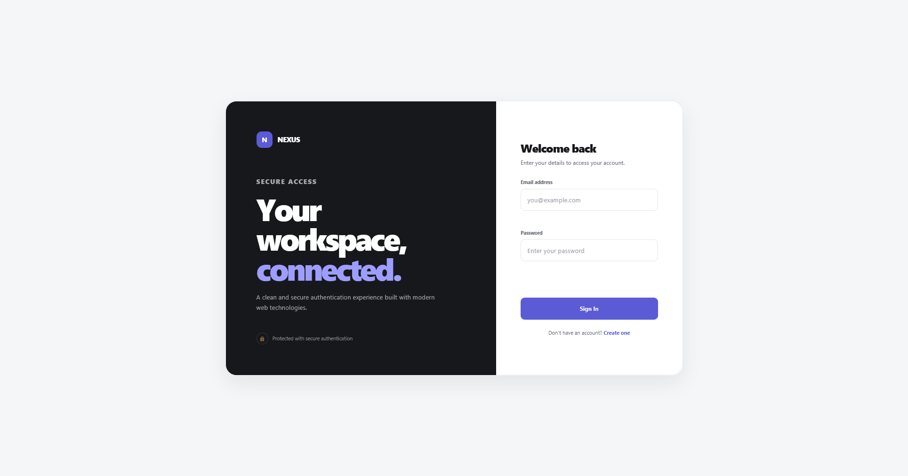
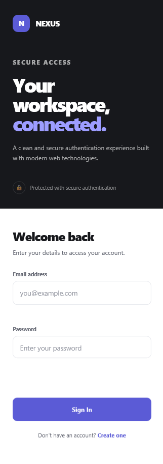

# NEXUS — Login Authentication System

A modern, full-stack login authentication system built with Node.js, Express, and SQLite as part of the **Oasis Infobyte AICTE OIB-SIP Web Development Internship**.

NEXUS provides a complete user authentication experience including account registration with validation, secure login, a protected dashboard, and session-based access control. Passwords are never stored in plain text — they are hashed using bcrypt before being written to the database.

## ✨ Features

### Authentication

- User registration with full name, email, and password
- Duplicate email detection with a clear error message
- User login with email and password
- Generic error message for invalid credentials — does not reveal which field is wrong
- Secure password hashing using bcrypt (12 salt rounds)
- Session-based authentication using HTTP-only cookies
- Protected dashboard accessible only after successful login
- Automatic redirect to login page when accessing the dashboard without a session
- Logout clears the server-side session and cookie, then redirects to the login page

### Validation

- Client-side validation on all forms before submission
- Password requirements enforced on both the client and server:
  - Minimum 8 characters
  - At least one number
- Email format validation using regex on both client and server
- Minimum name length check (2 characters)
- Confirm password field with mismatch detection
- No empty form submissions allowed — all fields are required
- Inline field error messages
- Loading state on submit buttons during API calls
- Input errors clear automatically when the user starts typing

### Security

- Passwords hashed with `bcryptjs` (12 salt rounds) — never stored in plain text
- Sessions managed server-side using `express-session`
- Session cookie flags: `httpOnly`, `sameSite: lax`, `secure` in production
- Session destroyed on logout with cookie cleared
- Parameterized SQL queries via `better-sqlite3` — protected against SQL injection
- Input trimmed and normalized before database operations
- Server returns identical error messages for wrong email and wrong password

### User Interface

- Split-panel auth layout with branded showcase section and form panel
- Responsive design — adapts to desktop and mobile screen widths
- Smooth focus states and inline validation feedback
- Loading and disabled state on submit buttons during requests
- Success and error form message display
- Dashboard shows the authenticated user's name and email
- Session status indicator on the dashboard

## 🛠️ Technologies

- **Node.js** — Server runtime
- **Express.js v5** — HTTP server and routing
- **express-session** — Server-side session management
- **bcryptjs** — Password hashing
- **better-sqlite3** — SQLite database (synchronous, no separate server required)
- **HTML5** — Page structure and semantic markup
- **CSS3** — Styling, responsive layout, and visual design
- **JavaScript (Vanilla ES6+)** — Client-side validation and fetch API calls

## 📁 Project Structure

```text
WebDev-L2-Login-Authentication/
├── data/
│   └── auth.db                  # SQLite database file (auto-created on first run)
├── public/
│   ├── css/
│   │   └── style.css
│   ├── js/
│   │   ├── login.js
│   │   ├── register.js
│   │   └── dashboard.js
│   ├── index.html               # Login page
│   ├── register.html            # Registration page
│   └── dashboard.html           # Protected dashboard page
├── server/
│   ├── auth.js                  # Authentication routes (register, login, me, logout)
│   └── database.js              # SQLite connection and schema initialisation
├── .gitignore
├── package.json
├── pnpm-lock.yaml
├── pnpm-workspace.yaml
├── server.js                    # Express app entry point
└── README.md
```

## 🔐 How Authentication Works

### Registration

1. User submits name, email, and password on the registration page
2. Client validates all fields before the request is sent
3. Server checks that the email does not already exist in the database
4. If the email is new, the password is hashed with bcrypt (12 salt rounds)
5. The user record (name, email, password hash) is inserted into SQLite
6. A success response is returned and the user is redirected to the login page

### Login

1. User submits email and password on the login page
2. Client validates fields before the request is sent
3. Server looks up the user by email
4. If no user is found, the server returns `"Invalid email or password."` — it does not reveal which field is wrong
5. If the user exists, `bcrypt.compare()` verifies the submitted password against the stored hash
6. If the password matches, `req.session.userId` is set and a session cookie is issued
7. The client is redirected to the dashboard

### Protected Dashboard

1. When `dashboard.html` loads, `dashboard.js` immediately calls `GET /api/auth/me`
2. The server checks `req.session.userId`
3. If no session exists, the server returns `401` and the client redirects to the login page using `window.location.replace()`
4. If the session is valid, the user's name and email are returned and displayed on the dashboard

### Logout

1. User clicks "Sign Out" on the dashboard
2. Client sends `POST /api/auth/logout`
3. Server calls `req.session.destroy()` and `res.clearCookie("connect.sid")`
4. Client is redirected to the login page

## 🗄️ Database Schema

```sql
CREATE TABLE IF NOT EXISTS users (
  id           INTEGER PRIMARY KEY AUTOINCREMENT,
  name         TEXT    NOT NULL,
  email        TEXT    NOT NULL UNIQUE,
  password_hash TEXT   NOT NULL,
  created_at   TEXT    NOT NULL DEFAULT CURRENT_TIMESTAMP
);
```

The database file is created automatically at `data/auth.db` the first time the server starts. No manual database setup is required.

## 📸 Screenshots

### Desktop



### Mobile



## 🚀 Getting Started

### Prerequisites

- [Node.js](https://nodejs.org) v18 or later
- [pnpm](https://pnpm.io) (recommended) — or npm / yarn

### Install Dependencies

Clone the repository:

```bash
git clone git@github.com:ezedinmoh/OIBSIP.git
```

Navigate to the project:

```bash
cd OIBSIP/WebDev-L2-Login-Authentication
```

Install packages:

```bash
pnpm install
```

Or with npm:

```bash
npm install
```

### Run Locally

Start the development server:

```bash
pnpm dev
```

Or with npm:

```bash
npm run dev
```

The server starts on:

```text
http://localhost:3000
```

Open your browser and navigate to `http://localhost:3000` to use the application.

> The SQLite database file is created automatically at `data/auth.db` on first run. No database setup or migration step is needed.

### Production Start

```bash
pnpm start
```

Or:

```bash
npm start
```

## 💻 Usage

### Creating an Account

1. Navigate to `http://localhost:3000/register.html`
2. Enter your full name, email address, and a password that is at least 8 characters and includes at least one number
3. Confirm your password in the second password field
4. Click **Create Account**
5. On success you will be redirected to the login page

### Signing In

1. Navigate to `http://localhost:3000`
2. Enter your registered email and password
3. Click **Sign In**
4. On success you will be redirected to the dashboard

### Dashboard

- The dashboard displays your name, email, and current session status
- The dashboard is only accessible while you have an active session
- Accessing `dashboard.html` directly without a session redirects you to the login page

### Signing Out

- Click **Sign Out** in the dashboard header
- Your session is destroyed on the server, the cookie is cleared, and you are redirected to the login page

## 🧪 Testing

The application was tested for the following:

- Registering a new account
- Attempting to register with a duplicate email
- Password too short — rejected with error message
- Password with no number — rejected with error message
- Mismatched confirm password — rejected with error message
- Empty form submission on registration — blocked client-side
- Empty form submission on login — blocked client-side
- Valid login with correct credentials
- Login with wrong email — generic error message shown
- Login with wrong password — same generic error message shown (no field disclosure)
- Accessing the dashboard without a session — redirects to login
- Dashboard loads and displays correct user name and email
- Logout destroys the session and redirects to login
- Accessing the dashboard after logout — redirects to login

## ✅ Oasis Infobyte Task 4 Checklist

The project covers all official Level 2 Task 4 requirements:

- [x] Registration page with username/email and password fields and a "Register" button
- [x] Password validation on registration: minimum 8 characters, at least 1 number
- [x] Duplicate email check — error displayed if the user already exists
- [x] Login page with email and password fields and a "Login" button
- [x] Incorrect credential handling — clear error message that does not reveal which field is wrong
- [x] Protected dashboard page — only accessible after successful login
- [x] Redirect to login if dashboard is accessed directly without a session
- [x] Logout button that clears the session and redirects to login
- [x] Passwords hashed with bcrypt — not stored in plain text
- [x] Basic form validation on both pages — no empty submissions

**Tech Stack approach used:** Option B — Full-stack Node.js + Express + SQLite

## 🎓 Internship

This project was developed as **Task 4** for the:

**Oasis Infobyte — AICTE OIB-SIP Web Development Internship Program**

Repository: **OIBSIP**

## 🔮 Future Improvements

Potential future improvements include:

- Email verification on registration
- Forgot password / password reset flow via email
- Rate limiting on login attempts to prevent brute-force attacks
- Refresh token support for longer sessions
- OAuth integration (Google, GitHub)
- User profile update page
- Additional accessibility enhancements

These are optional future improvements and are not required for the current internship task.

## 👨‍💻 Author

**Ezedin Mohammed**

Software Engineering Student & Full-Stack Developer

- LinkedIn: https://www.linkedin.com/in/ezedinmoh
- GitHub: https://github.com/ezedinmoh

## 📄 License

This project was created for educational and internship purposes.
