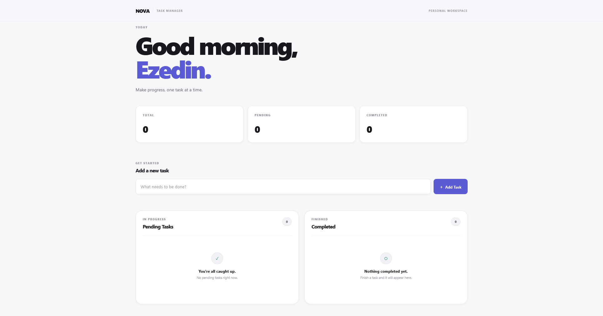
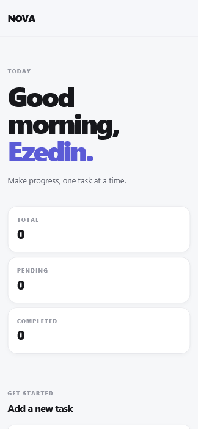

# NOVA — Personal Task Manager

A modern, responsive personal task manager built with HTML, CSS, and vanilla JavaScript.

NOVA helps users organize their daily work by creating tasks, tracking pending tasks, completing tasks, editing task details, and removing tasks when they are no longer needed. Tasks are stored locally in the browser using `localStorage`, allowing data to persist after refreshing or reopening the application.

## ✨ Features

### Task Management

- Add new tasks
- Edit existing tasks
- Delete tasks
- Mark pending tasks as completed
- Move completed tasks back to pending
- Complete tasks directly from the task action menu
- Confirm tasks before deletion
- Prevent empty tasks from being added
- Support task descriptions up to 200 characters

### Task Organization

- Separate Pending Tasks and Completed Tasks
- Automatically move tasks between task lists
- Display creation timestamps
- Display completion timestamps
- Show the total number of tasks
- Show the number of pending tasks
- Show the number of completed tasks
- Display task counts in each task section

### Data Persistence

- Store tasks using browser `localStorage`
- Preserve tasks after page refresh
- Preserve task completion status
- Preserve task creation timestamps
- Preserve task completion timestamps
- Handle invalid or corrupted stored data safely

### User Experience

- Modern and minimal interface
- Responsive desktop and mobile design
- Inline task editing
- Save edits with the Save button
- Cancel edits without changing the task
- Press `Enter` to save task edits
- Press `Escape` to cancel task editing
- Accessible labels for interactive controls
- Keyboard-friendly task input
- Focus states for keyboard navigation
- Empty states for pending and completed task lists
- Automatic current date display
- Reduced motion support

## 🛠️ Technologies Used

- **HTML5** — Application structure and semantic markup
- **CSS3** — Responsive layout, styling, transitions, and accessibility states
- **JavaScript (ES6+)** — Task management and application functionality
- **Web Storage API** — Persistent task storage using `localStorage`

## ⚙️ How It Works

NOVA manages tasks using JavaScript objects.

### Each task contains:

```js {
id: "unique-task-id",
text: "Task description",
completed: false,
createdAt: "ISO date",
completedAt: null
}
```

Tasks are stored in the browser using:

localStorage

Whenever a task is added, edited, completed, reopened, or deleted, the application:

1. Updates the task data

2. Saves the updated task list to localStorage

3. Re-renders the task lists

4. Updates task statistics

5. Updates the appropriate empty states

This ensures the interface always reflects the current application state.

### 📊 Task Statistics

The application automatically tracks:

Total tasks

Pending tasks

Completed tasks

Task counts update immediately whenever the user performs an action.

### 🧩 Task States

Pending

New tasks are created as pending tasks.

Users can:

Complete the task

Edit the task

Delete the task

Completed

Completed tasks are automatically moved to the Completed section.

Users can:

Move the task back to pending

Edit the task

Delete the task

### 📱 Responsive Design

NOVA is designed to work across different screen sizes.

Desktop

Two-column task layout

Pending and completed tasks displayed side by side

Optimized spacing and typography

Tablet

Responsive layout adjustments

Comfortable interaction areas

Mobile

Single-column task layout

Full-width task action button

Responsive typography

Optimized spacing

Mobile-friendly touch targets

### ♿ Accessibility

The application includes several accessibility improvements:

Semantic HTML structure

Accessible labels for task controls

Screen-reader-only labels

aria-live regions for task lists

aria-expanded state for task menus

Visible keyboard focus states

Keyboard support for editing tasks

Reduced motion support

### 💾 Data Persistence

Tasks are stored locally using the browser's localStorage API.

This means:

Tasks remain available after refreshing the page

Tasks remain available after closing and reopening the browser

Task completion status is preserved

Task timestamps are preserved

> Tasks are stored locally in the user's browser and are not synchronized with an external server.

### 📂 Project Structure

WebDev-L3-ToDo-App/
│
├── index.html
├── style.css
├── script.js
├── README.md
│
└── assets/
└── screenshots/
├── desktop.png
└── mobile.png

### 🚀 Getting Started

Clone the Repository

git clone git@github.com:ezedinmoh/OIBSIP.git

Navigate to the Project

cd OIBSIP/WebDev-L2-ToDo

Run Locally

Because this project uses only HTML, CSS, and JavaScript, no dependencies are required.

You can open index.html directly in a browser.

Alternatively, start a local server:

python3 -m http.server 5500

Then open:

http://localhost:5500

### 📸 Screenshots


### Desktop



### Mobile



### 🌐 Live Demo

🔗 **Live Website:** [\[Nova-task-one.vercel.app\]](https://nova-task-one.vercel.app)

### 🧪 Testing

The application has been tested for:

- Adding tasks

- Preventing empty tasks

- Editing tasks

- Saving edited tasks

- Cancelling task edits

- Saving edits with the Enter key

- Cancelling edits with the Escape key

- Completing tasks

- Moving completed tasks back to pending

- Completing tasks from the action menu

- Deleting tasks

- Confirming task deletion

- Updating task statistics

- Updating section task counts

- Displaying pending empty states

- Displaying completed empty states

- Hiding empty states when tasks exist

- Restoring tasks after page refresh

- Responsive desktop layout

- Responsive mobile layout

### 🔒 Data & Privacy

NOVA does not use a backend or external database.

All task data is stored locally in the browser using localStorage.

Clearing browser storage or browser site data will remove stored tasks.

### 🎯 Project Purpose

This project was created as part of the Oasis Infobyte Web Development Internship.

The goal of the project is to demonstrate practical frontend development skills, including:

- DOM manipulation

- Event handling

- State management

- Browser storage

- Responsive design

- Accessibility

- User interface design

- JavaScript application logic

### 👨‍💻 Author

Ezedin Mohammed

GitHub: https://github.com/ezedinmoh

LinkedIn: https://www.linkedin.com/in/ezedinmoh

Portfolio: https://ezedinmoh.vercel.app

### 📄 License

This project was created for educational and internship purposes.

```
Built with ❤️ using HTML, CSS, and JavaScript.
```
