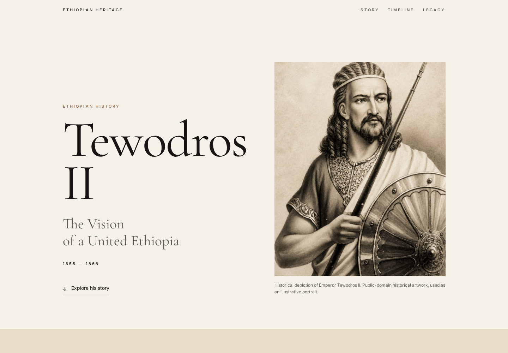
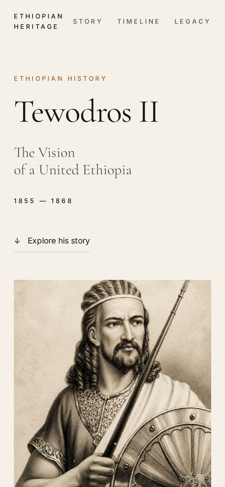

# Tewodros II — The Vision of a United Ethiopia

An editorial-style tribute page exploring Emperor Tewodros II (1855–1868), his attempt to strengthen imperial authority, reform state institutions, modernize the military, correspond with European powers, and the fall of Maqdala in 1868.

> **Educational project:** This is an independent student tribute page created for the Oasis Infobyte Web Development & Designing internship. It is not an official historical publication or museum website.

## ✨ Features

- Premium editorial / digital-exhibition visual design
- Responsive desktop and mobile layouts
- Art-directed historical portrait hero with blended archival styling
- Original biography/context content written for the project
- Tewodros II's rise from Kassa Hailu to the imperial throne
- "One Crown. One State." centralization section with two supporting historical visuals
- Reform and modernization overview
- 1862 correspondence with Queen Victoria
- Historically sourced quotation from Tewodros II's letter
- Interactive JavaScript timeline
- Maqdala / Magdala section with photographic treatment and parallax motion
- Legacy section presenting both ambitions and conflicts
- Ethiopian heritage and Maqdala restitution context
- Scroll-reveal animations
- Scroll-aware navigation state
- Back-to-top control
- Reduced-motion accessibility support
- Semantic HTML and descriptive image alternatives
- Local image assets for reliable deployment and faster repeat visits

## 🧰 Technologies

- HTML5
- CSS3
- Vanilla JavaScript
- Google Fonts — Cormorant Garamond + Inter
- Wikimedia Commons historical reference material

No frontend framework or build system is required.

## 📁 Project Structure

```text
WebDev-L2-TributePage/
├── assets/
│   ├── images/
│   │   ├── ethiopia-1850-map.webp
│   │   ├── maqdala.webp
│   │   ├── sebastopol.webp
│   │   └── tewodros-hero.webp
│   └── screenshots/
│       ├── desktop.png
│       └── mobile.png
├── index.html
├── script.js
├── style.css
└── README.md
```

## 🚀 Run Locally

This is a static website, so no package installation is required.

From the project directory:

```bash
python3 -m http.server 8000
```

Then open:

```text
http://localhost:8000
```

You can also open `index.html` directly in a browser, although a local server is recommended for testing the project exactly as it will behave when deployed.

## 🖼️ Image Credits, Sources & Licensing

The website uses locally stored, enhanced or AI-assisted visual recreations prepared for this student project. The original historical references are credited below. The generated/reworked presentation should not be mistaken for the original Wikimedia Commons file.

### Tewodros II portrait

**Reference source:** Wikimedia Commons — [Tewodros II of Ethiopia in the 1860s](https://commons.wikimedia.org/wiki/File:Tewodros_II_of_Ethiopia_in_the_1860s.jpg)

- Approximate date: 1860s
- Photographer / studio attribution: Neurdein
- Source status: Public domain / Public Domain Mark as listed by Wikimedia Commons
- Website asset: `assets/images/tewodros-hero.webp`
- Treatment: enhanced, art-directed historical presentation for the website

### Maqdala / Magdala landscape

**Reference source:** Wikimedia Commons — [Meḳdelā or Magdala](https://commons.wikimedia.org/wiki/File:Me%E1%B8%B3del%C4%81_or_Magdala.jpg)

- Author: Asrade
- Date: 20 January 2021
- License: **CC BY-SA 4.0**
- Website asset: `assets/images/maqdala.webp`
- Attribution: **Asrade / Wikimedia Commons**
- Treatment: enhanced presentation for the website
- If the original image is redistributed or adapted, the applicable CC BY-SA attribution and ShareAlike requirements must be respected.

### Ethiopia around 1850 map

**Reference source:** Wikimedia Commons — [Ethiopia Map-1850](https://commons.wikimedia.org/wiki/File:Ethiopia_Map-1850.jpg)

- Description: Ethiopia around 1850
- Base source: CIA shaded-relief map
- Derivative author listed by Wikimedia Commons: Zheim
- License: **Public domain**
- Website asset: `assets/images/ethiopia-1850-map.webp`
- Treatment: AI-assisted museum-style visual recreation inspired by the public-domain source
- Purpose: provides geographic context for the fragmented regional landscape discussed in the centralization section

### Sebastopol mortar

**Reference source:** Wikimedia Commons — [Tewodros II Sebastopol](https://commons.wikimedia.org/wiki/File:Tewodros_II_Sebastopol.jpg)

- Depicts: Tewodros II's soldiers dragging the great mortar known as "Sebastopol"
- Date of source image: 1869
- Source cited by Wikimedia Commons: Bahru Zewde, *A History of Modern Ethiopia, 1855–1991*, 2002, p. 29
- License: **Public domain / free of known copyright restrictions** as listed by Wikimedia Commons
- Website asset: `assets/images/sebastopol.webp`
- Treatment: AI-assisted vintage engraving-style visual recreation inspired by the public-domain source
- Purpose: illustrates Tewodros II's military and technological ambitions

## 📜 Historical Accuracy Notes

The project intentionally distinguishes between **Tewodros II's ambitions** and outcomes that were actually achieved.

### The 1862 letter

The quotation used on the page comes from a historical English translation of Tewodros II's letter to Queen Victoria. The UK Parliament's 1865 Hansard record reproduces the passage:

> “God created me, lifted me out of the dust, and restored this empire to my rule.”

The project uses a shortened version of the passage for visual presentation and identifies it as a translation rather than an original English-language quotation.

Source: [UK Parliament — Imprisonment Of British Subjects In Abyssinia](https://hansard.parliament.uk/lords/1865-07-04/debates/e2269d57-ca76-4582-90a9-99e0c85da6ea/ImprisonmentOfBritishSubjectsInAbyssinia)

The British Museum also records that Tewodros wrote to Queen Victoria in 1862 seeking British assistance and that the Foreign Office failed to pass the letter to the Queen. Source: https://www.britishmuseum.org/about-us/british-museum-story/contested-objects-collection/maqdala-collection

### Maqdala, 1868

The timeline distinguishes between the major engagement at **Aroge on 10 April 1868**, the assault on **Maqdala on 13 April 1868**, and the subsequent destruction of the fortress by military order on **17 April 1868**.

Source: [British Museum — Maqdala collection](https://www.britishmuseum.org/about-us/british-museum-story/contested-objects-collection/maqdala-collection)

The British Museum documents the removal of Ethiopian manuscripts, religious objects, royal material, textiles, weapons and other cultural objects following the fall of Maqdala. The project therefore treats the legacy section as a history of both political ambition and contested cultural heritage.

### Centralization and modernization

The "One Crown. One State." section is deliberately written as an **ambition** rather than a claim that Tewodros completed a fully centralized modern state. His reign involved campaigns to extend imperial control, resistance from regional powers, institutional reform efforts and attempts to acquire military technology and expertise.

## ♿ Accessibility & UX

- Semantic HTML5 structure
- Descriptive `alt` text for images
- Keyboard-visible focus indicators
- `aria-label` and `aria-current` where appropriate
- Reduced-motion support through `prefers-reduced-motion`
- Responsive typography and layouts
- High-contrast text treatment on the red, charcoal and parchment sections
- Local image assets to avoid broken external-image dependencies
- Scroll interactions kept lightweight and progressively enhanced with JavaScript

## 📱 Screenshots

### Desktop



### Mobile




## 🌐 Live Demo

[Open the live] https://webdev-l2-tribute.vercel.app and
[Second Domain] https://emperor-tewodros.vercel.app

## 🚀 Deployment

The application is deployed using **Vercel**.

The project is a static HTML, CSS, and JavaScript application, so no build process, backend server, database, or environment variables are required.

### Deployment Platform

- Vercel
- Production deployment
- Responsive production-tested application

## 🧪 Testing

The deployed application was tested after production deployment.

## ✅ Oasis Infobyte Task 2 Checklist

The project covers the official Level 2 Task 2 requirements:

- [x] Page title with subject name and one-line tagline
- [x] Prominent historical image with Wikimedia Commons source documentation
- [x] Original biography / tribute content with multiple paragraphs
- [x] Timeline / key achievements section
- [x] Distinctly styled quote block
- [x] Multiple background colours across sections
- [x] Serif display typography + sans-serif body typography
- [x] Responsive desktop and mobile layout

The project also includes optional portfolio-quality enhancements such as animation, navigation state, parallax treatment, accessibility polish, local optimized image assets, and a richer editorial layout.

## 👨‍💻 Author

**Ezedin Mohammed**  
Software Engineering Student — Wollo University  
Full-Stack Developer / Software Engineer

- GitHub: https://github.com/ezedinmoh
- LinkedIn: https://www.linkedin.com/in/ezedinmoh

## 📄 License

The source code of this student project is provided for educational and portfolio purposes.

Third-party historical references and images remain subject to their respective licenses and attribution requirements listed above. In particular, the Maqdala / Magdala reference image is **CC BY-SA 4.0** and must not be treated as public-domain material.
